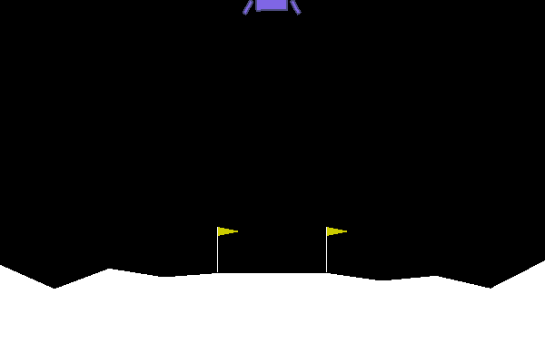

# Deep Q-Networks

Teach a reinforcement learning agent to play Lunar Lander with Deep-Q Learning.

## Setting up the environment

To create the environment

    conda env create -f environment.yml

To activate the environment

    conda activate dqn

## Running the code

To train the agent using default parameters

    python train.py config.yaml results
  
Results are written to the following tree structure:

    results
    ├── config.yaml
    └── repeat*
        ├── average_scores.npy
        ├── model.h5
        ├── scores.npy
        └── weights
            └── episode*_score*.h5
